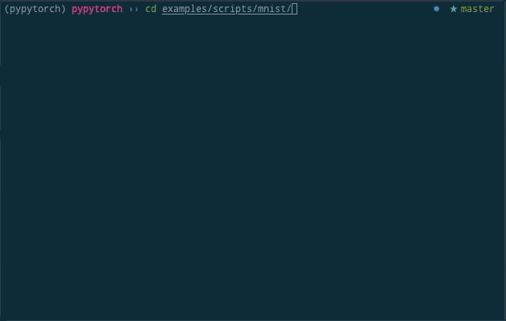

---

**PyPyTorch is a simple deep learning framework implemented by Python3**

# Contents

* [Introduction](#introduction)
* [Installation](#installation)
  * [PyPI](#pypi)
  * [From Source](#from-source)

## Introduction

**PyPyTorch** is very similar to PyTorch, most of APIs are the same as PyTorch, at this stage, this framework enables us to understand how dynamic neural network works. If you master PyTorch, you can master PyPyTorch in a short time. There are some important and core modules in PyPyTorch. By the way, you can call its nickname **PPT** for short

| Module    | Description                                                  |
| --------- | ------------------------------------------------------------ |
| pypytorch | The entry of PyPyTorch framework, once you import pypytorch, you can work everything with PyPyTorch |
| data      | Privides dataset, dataloader and transforms                  |
| functions | A operator libaray for Tensor object in PyPyTorch            |
| nn        | A high level neural network library in PyPyTorch which built on functions module, you can build a neural network model very fast with the help of nn |
| optim     | There are some optimizers, including SGD, Adam(will add in the coming future) and so on |

## Installation

### PyPI

1. `pip3 install pypytorch` I will add pypytorch to PyPI in the coming future

### From Source

1. `git clone https://github.com/dark-ai/pypytorch.git`
2. `cd pypytorch`
3. `pip install -r requirements.txt`
4. `make install && make clean`

